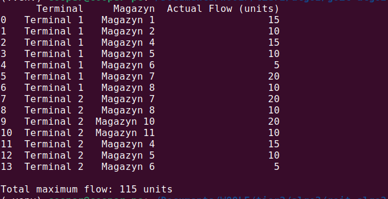

# Домашнє завдання до модуля “Просунуті структури для оптимізації та пошуку” (теми 3 та 4)

## Завдання 1. Застосування алгоритму максимального потоку для логістики товарів

Розробіть програму для моделювання мережі потоків для логістики товарів зі складів до магазинів, використовуючи алгоритм максимального потоку. Проведіть аналіз отриманих результатів і порівняйте їх з теоретичними знаннями.

## Розвязок (Завдання 1)

#### Q. Які термінали забезпечують найбільший потік товарів до магазинів?

#### A. Terminal 2 - найбільший обсяг потоку до магазинів.

- Sklad 4: 30 одиниць
- Sklad 3: 15 одиниць
- Sklad 2: 10 одиниць
- Total : 55 одиниць

Terminal 1 більш сумарна пропускну здатність (60 одиниць), але факт є фактом - потік менший через обмеження на подальших маршрутах.
<i>Висновок: Terminal 2 відіграє ключову роль у загальному потоці товарів завдяки кращим каналам розподілу через свої склади.</i>

#### Q. Які маршрути мають найменшу пропускну здатність і як це впливає на загальний потік?

#### A. Маршрути з найменшою пропускною здатністю:

- Sklad 4 -> Magazyn 13: 5 одиниць
- Sklad 4 -> Magazyn 14: 10 одиниць
- Sklad 2 -> Magazyn 5: 10 одиниць
- Sklad 2 -> Sklad 2: 10 одиниць
- Sklad 3 -> Magazyn 9: 10 одиниць

<i>Через вузькі канали частина товарів затримується на складах. Склади, що мають великий обсяг, не можуть передати весь потік далі до магазинів, що погано впливає на ефективність мережі.</i>

#### Q. Які магазини отримали найменше товарів і чи можна збільшити їх постачання?

#### A. Магазини з мінімальним постачанням:

- Magazyn 13
- Magazyn 5
- Magazyn 9

Можливе покращення:

Збільшити пропускну здатність ребер:

- Sklad 4 -> Magazyn 13 (з 5 до 10)
- Sklad 3 -> Magazyn 9 (з 10 до 15)
- Sklad 2 -> Magazyn 5 (з 10 до 20)

<i>Це дозволить перенаправити частину потоку, який залишається невикористаним на складах.</i>

#### Q. Чи є вузькі місця, які можна усунути для покращення ефективності логістичної мережі?

#### A. Вузькі місця в мережі:

- Склади з недостатньою кількістю або потужністю вихідних маршрутів
- Магазини з лімітованим прийомом товарів (≤10 одиниць)
- Маршрути від складів до магазинів з низькими значеннями capacity

<i>Поточна логістична мережа досягає максимального потоку в 115 одиниць, однак її ефективність обмежена пропускною здатністю на останньому етапі доставки — від складів до магазинів. Оптимізація цих вузьких місць дозволить значно покращити постачання та зменшити перевантаження на складах.</i>

## Задача 2. Розширення функціоналу префіксного дерева

Реалізуйте два додаткових методи для класу Trie:

count_words_with_suffix(pattern) для підрахунку кількості слів, що закінчуються заданим шаблоном;
has_prefix(prefix) для перевірки наявності слів із заданим префіксом.
